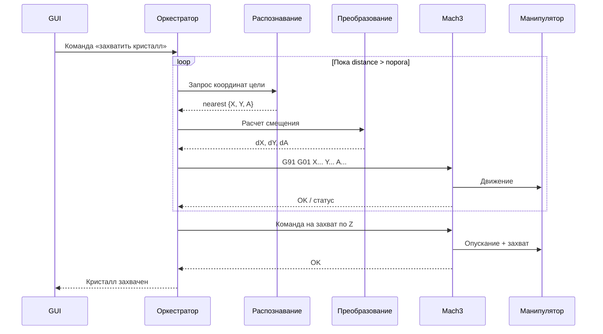

## Общая схема системы

```mermaid
flowchart TB
    CAM[Камера]

    subgraph SW[Программная часть на Python]
        GUI[Визуальный интерфейс\n(gui.py)]
        ORCH[Оркестратор данных\n(_StreamEngine / orchestrator)]

        subgraph VISION[Система распознавания]
            VSRC[Источник видео\n(VideoSource)]
            NEURAL[Менеджер обработки\n(NeuralManager)]
            M1[Шаг 1:\n__particle_centers]
            M2[Шаг 2:\n__particle_centers_pin]
            M3[Шаг 3:\n__particle_centers_grid]
            M4[Шаг 4:\n__particle_centers_nearest]
            VSRC -->|кадр BGR| NEURAL
            NEURAL --> M1 --> M2 --> M3 --> M4
        end

        TRANSFORM[Преобразование координат\n(пиксели -> мм -> команда движения)]
        CONTROL[Контур управления установкой\n(mach3_bridge)]
    end

    subgraph HW[Физическая часть]
        ESTOP[Кнопка аварийной остановки]
        MACH[Mach3]
        MANIP[Манипулятор]
        ESTOP -->|аппаратный стоп| MACH
        MACH -->|управление приводами| MANIP
    end

    CAM -->|видеопоток| VSRC
    M4 -->|цель: X, Y, A| ORCH
    GUI -->|команды оператора| ORCH
    ORCH -->|статус и телеметрия| GUI
    ORCH -->|координаты| TRANSFORM
    TRANSFORM -->|dX, dY, dA| CONTROL
    CONTROL -->|обратная связь| ORCH
    CONTROL -->|G-код| MACH

    classDef hw fill:#f6f6f6,stroke:#8a8a8a,color:#111,stroke-width:1px;
    classDef sw fill:#fbfbff,stroke:#5a6ea8,color:#111,stroke-width:1px;
    classDef key fill:#eef3ff,stroke:#3f5aa9,color:#111,stroke-width:2px;
    class ESTOP,MACH,MANIP,CAM hw;
    class GUI,VSRC,NEURAL,M1,M2,M3,M4,ORCH,TRANSFORM,CONTROL sw;
    class ORCH,CONTROL key;
```

## Поток данных (текущая реализация)

```mermaid
flowchart TB
    subgraph STAGE1[Этап 1. Захват и подготовка кадра]
        A1[Захват кадра\ncv2.VideoCapture]
        A2[Предобработка\nCLAHE + Blur]
        A1 --> A2
    end

    subgraph STAGE2[Этап 2. Детекция объектов]
        B1[Сегментация\nAdaptive threshold + HSV]
        B2[Очистка маски\nморфология]
        B3[Разделение объектов\nWatershed / k-means]
        B4[Фильтрация\nNMS + критерии качества]
        B1 --> B2 --> B3 --> B4
    end

    subgraph STAGE3[Этап 3. Трекинг и геометрия]
        C1[Трекинг\nid (tid) + сглаживание угла]
        C2[Пиксельные параметры\ncx, cy, w, h, angle]
        C1 --> C2
    end

    subgraph STAGE4[Этап 4. Координаты и выбор цели]
        D1[Перевод в мм\nscale_x, scale_y, offsets]
        D2[Выбор цели\nnearest или pinned]
        D3[Результат\nparticle_nearest: X, Y, A, distance]
        D1 --> D2 --> D3
    end

    A2 --> B1
    B4 --> C1
    C2 --> D1
```

## Цикл управления



## Структура проекта

```mermaid
graph TD
    ROOT[/]
    ROOT --> MAIN[main.py]
    ROOT --> GUI[gui.py]
    ROOT --> CFG[config.json]
    ROOT --> CORE[__core]

    CORE --> CAM[__camera]
    CAM --> CFM[config_models.py]
    CAM --> CFS[config_service.py]
    CAM --> VS[video_source.py]
    CAM --> VIEW[viewer.py]
    CAM --> NN[__neural]

    NN --> BASE[base.py]
    NN --> MGR[manager.py]
    NN --> MODS[mods]

    MODS --> PC[__particle_centers.py]
    MODS --> PP[__particle_centers_pin.py]
    MODS --> PG[__particle_centers_grid.py]
    MODS --> PN[__particle_centers_nearest.py]
    MODS --> HUD[__hud_info.py]
```

## Соответствие эталонной схеме

| Блок на эталонной схеме | Текущая реализация | Статус |
|---|---|---|
| Визуальный интерфейс | `gui.py` (Flet) | Реализовано |
| Оркестратор данных | `_StreamEngine` в `gui.py` | Реализовано |
| Система распознавания | `NeuralManager` + моды | Реализовано |
| Алгоритмы преобразования | `particle_grid` (пиксели -> мм) | Реализовано |
| Управление установкой | `mach3_bridge` | Реализовано |
| Mach3 | Внешний контроллер движения | Подключено |
| Манипулятор | Исполнительный механизм по осям | Подключено |
| Кнопка аварийной остановки | Аппаратный стоп через контроллер | Подключено |

## Контур управления (по текущему коду)

1. `Mach3Bridge` (`__core/__movement/__init__.py`) — TCP-клиент к серверному модулю Mach3 (обёртка над `moch3_lib`: G-code через сокет).
2. Планировщик траектории отдельным модулем не выделен: команды формируются в библиотеке движения и из GUI (джог, именованные макросы, «к кристаллу»).
3. Оркестрация кадра — `_StreamEngine` в `gui.py`: источник видео → нейро-моды → отображение; с Mach3 взаимодействует по действиям оператора, не закрытый цикл «захватить все кристаллы» в одном процессе.
4. Безопасность: аппаратный E-stop на стороне стенда; в ПО — лимиты и проверки в `moch3_lib`, таймауты сокета, блокировка команд при отсутствии подключения.
