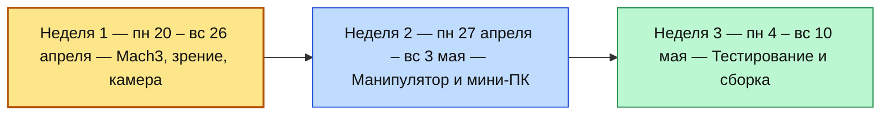
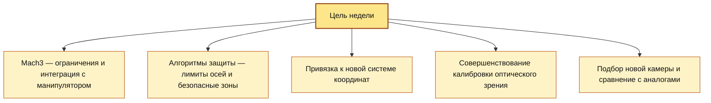
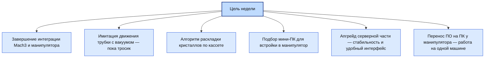
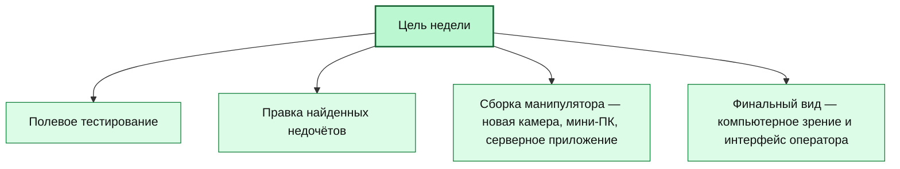
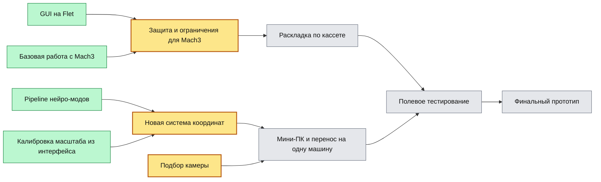

# Дорожная карта проекта

> Проект АО «БЗПП». Отчёт понедельно.

---

## Общая схема по неделям

---

## Неделя 1 — пн 20 – вс 26 апреля (текущая)

**Цель:** надёжный канал управления манипулятором и точная система координат.

---

## Неделя 2 — пн 27 апреля – вс 3 мая

**Цель:** замкнуть контур манипулятора и собрать всё на одной машине.

---

## Неделя 3 — пн 4 – вс 10 мая

**Цель:** готовый прототип манипулятора.

---

## Прогресс по статусам

Легенда: жёлтое — сейчас, зелёное — готово, серое — запланировано.
